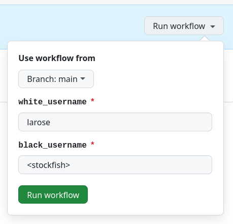
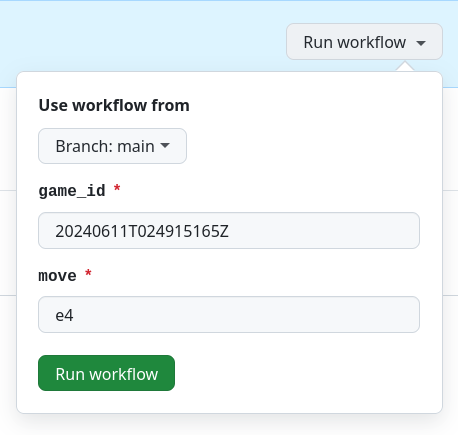

# Play Chess with Friends (or Stockfish) on GitHub

Want to challenge your friends (or the AI!) to a game of chess directly on GitHub? This project makes it possible!

## Getting Started

### Step 1: For This Repository

Fork this repository and invite your friends as collaborators (for a personal repository) or as members with write access (for a repository within an organization). This step is necessary because only collaborators or members with write access are allowed to run workflows.

### Step 2: Creating a New Game

- Run the "Create Game" workflow.
- Enter the GitHub usernames for both players. You can even challenge the Stockfish chess engine by entering `<stockfish>` as a username.
- After the workflow runs successfully, a new file will be created in the [`games`](games) directory. The game's ID is its filename without the extension. For instance: [`games/20240611T024915165Z.pgn`](games/20240611T024915165Z.pgn) -> `20240611T024915165Z`.
- The ASCII representation of the latest game state is included in the game file.

### Step 3: Making a Move

- Run the "Make Move" workflow.
- Enter the game ID and your move using [Algebric Notation](<https://en.wikipedia.org/wiki/Algebraic_notation_(chess)>). Both short and long (e.g., `e2e4`) algebraic notations are accepted.

## Why Was This Created?

There's absolutely no reason for this project to exist in the universe, yet here it is.

## Under the Hood

This project uses the excellent [chess.js](https://github.com/jhlywa/chess.js) package in combination with GitHub Actions to ensure only valid moves are allowed, and moves can only be made when it's your turn. For the chess engine, it leverages the powerful [Stockfish](https://stockfishchess.org).
